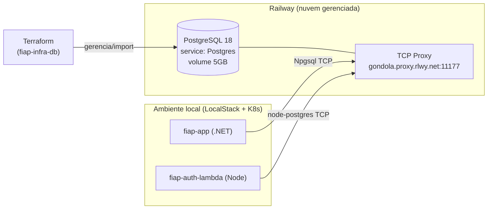

# fiap-infra-db

Infraestrutura do **banco de dados gerenciado** (PostgreSQL no **Railway**), provisionada e gerenciada via **Terraform**. Um dos 4 repositórios do Tech Challenge — Fase 3 (SOAT/FIAP).

## Parte do sistema (4 repositórios)

| Repositório | Papel |
|---|---|
| [fiap-auth-lambda](https://github.com/MathboyL3/fiap-auth-lambda) | Autenticação por CPF → JWT (API Gateway + Lambda) |
| [fiap-app](https://github.com/MathboyL3/fiap-app) | API principal da oficina (.NET / Kubernetes) |
| [fiap-infra-k8s](https://github.com/MathboyL3/fiap-infra-k8s) | Infra do cluster (Terraform) |
| [fiap-infra-db](https://github.com/MathboyL3/fiap-infra-db) | Banco de dados gerenciado (Terraform + Railway) |

> Arquitetura, diagrama de componentes (cloud) e diagramas de sequência:
> [fiap-app/docs/ARQUITETURA.md](https://github.com/MathboyL3/fiap-app/blob/main/docs/ARQUITETURA.md).
> Guia de entrega: [fiap-app/docs/ENTREGA.md](https://github.com/MathboyL3/fiap-app/blob/main/docs/ENTREGA.md).

## Propósito
Prover um **Postgres gerenciado de verdade** (backup, volume persistente, operação pelo provedor) e expor, de forma versionada, os dados de conexão que os demais repositórios consomem:

- **fiap-app** (API .NET) — `ConnectionStrings:Postgres`
- **fiap-auth-lambda** (Function de auth CPF→JWT) — `DATABASE_URL`

## Tecnologias
- **Terraform** (`>= 1.5`) + provider **terraform-community-providers/railway** `~> 0.6`
- **PostgreSQL 18** gerenciado no **Railway** (imagem `ghcr.io/railwayapp-templates/postgres-ssl:18`, volume de 5 GB)
- **GitHub Actions** (fmt / validate / plan em PR; apply no merge)

## Arquitetura



- **Acesso interno** (workloads dentro do Railway): `postgres.railway.internal:5432`.
- **Acesso externo** (app/lambda locais): TCP proxy público `gondola.proxy.rlwy.net:11177`.

## Outputs (consumidos pelos outros repos)
| Output | Descrição |
|---|---|
| `postgres_host` / `postgres_port` | endpoint público (via TCP proxy) |
| `postgres_internal_host` | endpoint interno Railway |
| `postgres_database` / `postgres_username` | `railway` / `postgres` |
| `dotnet_connection_string_template` | string Npgsql (.NET) — senha via `${PGPASSWORD}` |
| `database_url_template` | `DATABASE_URL` (libpq/node) — senha via `${PGPASSWORD}` |

> A **senha não é versionada nem exposta** nos outputs: entra em runtime via variável `PGPASSWORD` (secret). Ver `docs/adr/0002-*`.

## Pré-requisitos
- Terraform `>= 1.5`
- Um **Railway Account/Workspace token** (em Railway → Account Settings → Tokens)

## Execução / Deploy
```bash
# 1) Autenticação (NÃO versionar o token)
export RAILWAY_TOKEN="<seu-railway-account-token>"

# 2) Inicializar e validar
terraform init
terraform fmt -check -recursive
terraform validate

# 3) Plano e aplicação (idempotente — importa o Postgres já existente)
terraform plan
terraform apply
```
O `apply` faz **import** do service Postgres já provisionado (não recria o banco — `0 to destroy`) e materializa os outputs.

### Obter a senha do banco
A senha é gerada pelo Railway. Recupere via CLI/API e injete como `PGPASSWORD`:
```bash
railway variables --service Postgres   # ou via GraphQL (ver scripts)
```

## CI/CD
`.github/workflows/terraform.yml`:
- **PR → main:** `fmt -check`, `init`, `validate`, `plan`.
- **push → main (merge):** `apply` (requer o secret `RAILWAY_TOKEN`).

Configure o secret: **Settings → Secrets and variables → Actions → `RAILWAY_TOKEN`**.

> O state é local/efêmero no CI; como o plano é idempotente (import + outputs, `0 changes`), o apply é seguro. Para produção real, migrar para backend remoto (S3/Terraform Cloud).

## Documentação
- [`docs/MODELO-DADOS.md`](docs/MODELO-DADOS.md) — diagrama ER, relacionamentos e justificativa do banco.
- [`docs/adr/0001-escolha-banco-gerenciado-railway.md`](docs/adr/0001-escolha-banco-gerenciado-railway.md)
- [`docs/adr/0002-gestao-de-segredos-e-tcp-proxy.md`](docs/adr/0002-gestao-de-segredos-e-tcp-proxy.md)
