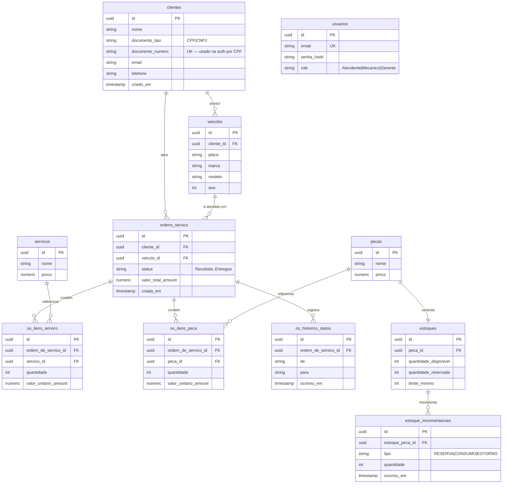

# Modelo de Dados — Justificativa e Diagrama ER

## Justificativa formal da escolha do banco

**Escolha: PostgreSQL (relacional), gerenciado no Railway.**

O domínio da oficina é **fortemente transacional e relacional**:
- Uma **Ordem de Serviço (OS)** referencia **Cliente** e **Veículo**, agrega **itens de serviço** e **itens de peça**, e mantém **histórico de status**. Essas relações exigem **integridade referencial** (FKs) e **transações ACID** (ex.: ao finalizar a OS, o consumo de estoque e a mudança de status devem ser atômicos).
- O **controle de estoque** usa reserva → consumo/estorno, que são operações que **não podem ficar inconsistentes** — um banco relacional com transações é a escolha natural (vs. NoSQL eventual).
- Consultas analíticas do negócio (volume de OS por dia, **tempo médio por status**, erros de integração) se beneficiam de **SQL**, agregações e *joins*.

**Por que PostgreSQL** (e não MySQL/SQL Server):
- Tipos ricos (`numeric(18,2)` para dinheiro, `timestamp with time zone`, `enum`/check), essenciais para valores monetários e máquina de estados da OS.
- Excelente suporte no ecossistema .NET via **Npgsql/EF Core** (já usado na Fase 1/2).
- Open-source, sem custo de licença, e **gerenciado gratuitamente** em provedores com free tier.

**Por que gerenciado no Railway** (vs. Postgres no cluster K8s da Fase 2):
- A Fase 3 exige **banco gerenciado**: o provedor cuida de provisionamento, volume persistente, backups e disponibilidade — separando a responsabilidade de dados do ciclo de vida do cluster.
- Railway tem **free tier** sem cartão de crédito e é provisionável por **Terraform** (IaC), atendendo ao requisito sem custo de nuvem paga.
- Portável: a connection string e o modelo são idênticos a um RDS/Aurora — migração futura é trivial.

## Ajustes no modelo relacional (Fase 3)
O modelo da Fase 1/2 foi **mantido** (estável e validado). Os ajustes da Fase 3 são de **operação**, não de esquema:
- Banco movido do cluster para serviço **gerenciado** (Railway) — mesma estrutura de tabelas.
- Acesso externo via **TCP proxy** (fiap-auth no Railway e app K8s local) e interno via `postgres.railway.internal`.
- O **serviço de autenticação** (fiap-auth) lê a tabela `clientes` (consulta por CPF em `documento_numero`) — nenhum campo novo é necessário, pois o CPF já existe como `documento_numero` com `documento_tipo`.

## Diagrama ER

## Relacionamentos (resumo)
- **Cliente 1—N Veículo**, **Cliente 1—N OS**, **Veículo 1—N OS**.
- **OS 1—N** itens de serviço / itens de peça / histórico de status.
- **Peça 1—1 Estoque**; **Estoque 1—N Movimentação** (reserva/consumo/estorno).
- **Usuário** é isolado (autenticação administrativa por role).

O esquema real é criado/evoluído por **EF Core migrations** (`ctx.Database.Migrate()` no startup da `fiap-app`). Este repositório provisiona a **instância gerenciada**; o schema é responsabilidade da aplicação.
